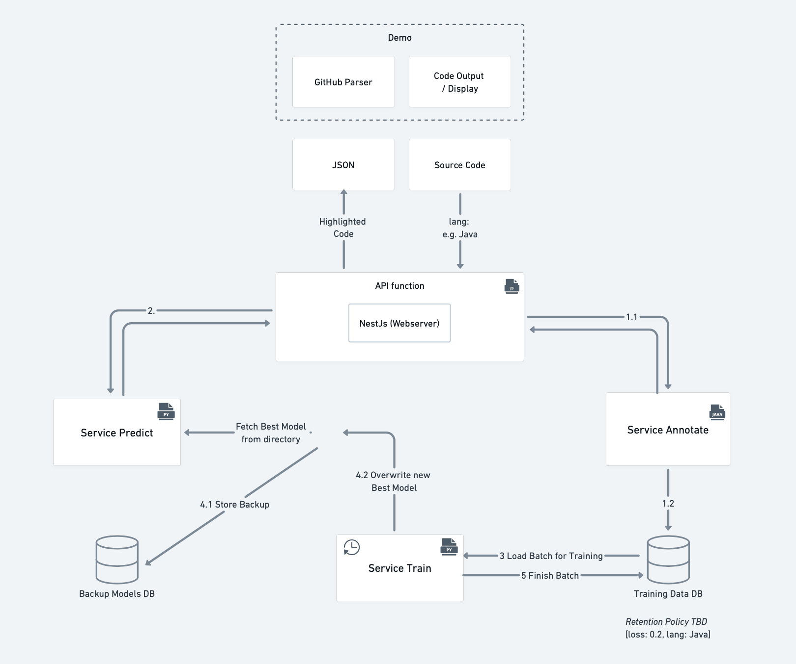

<h1 align="center">
  Annotation WebService
  <br>
</h1>
<p align="center">
  <a href="https://github.com/Hack3rz-Official/annotation-web-service/actions">
    
  </a>
  <a href="https://sonarcloud.io/dashboard?id=Hack3rz-Official_annotation-web-service">
      
  </a>
  <a href="https://sonarcloud.io/dashboard?id=Hack3rz-Official_annotation-web-service">
        
    </a>
</p>

## Introduction
A syntax highlighting web service based on AI. Please read the [project instructions](https://seal-uzh.notion.site/Annotation-WebService-b9621a3b1b5943cba21ede82d2fcbfe3) for more details about all functionalities. 

## Wiki
Under the hood, the Annotation WebService consists of the following independent microservices:

| Microservice             | Description                                                                | Technology |
|--------------------|----------------------------------------------------------------------------|------------|
| [Annotation Service]() | Handles the lexing and highlighting of code. | Java with [Spring Boot](https://github.com/spring-projects/spring-boot)|
| [Prediction Service]()  | Handles the prediction of syntax highlighting.         | Python with [Flask](https://github.com/pallets/flask) |
| [Training Service]()   | Handles the regularily conducted training and exchange of the underlying prediction models.         | Python with [Flask](https://github.com/pallets/flask) |
| [Web API]()          | The web API that acts as the primary entry point for the customers.        | JS/TS with [Nest.js](https://github.com/nestjs/nest) |


## How it works
The following illustration depicts the flow of the Annotation WebService.



After having called the `Web API` with code to be syntax highlighted, the following will be processed:
1. The code will be lexed and highlighted. This is done by the `Annotation Service` microservice. The lexed code will be returned to the `Web API` whereas the highlighted code will be stored on the Training Database.
2. The `Web API` will then forward the `tok_ids` extracted from the lexed code to the `Prediction Service` microservice where the syntax highlighting is beeing predicted. The predicted syntax highlighting will be returned to the `Web API`.
3. Having received the predicted `h_code_values` the `Web API` will create a json file with the highlighted code which will be returned to the caller.

Regularily, the `Training Service` will be triggered to train the underlying prediction models. First, it will load training data from the Training Database. Then, it will train the underlying prediction models with 80% of the data and validate the improved model with the remaining 20% of the data. If the loss is smaller on the new model than the old one, the new model will be saved. Every time the `Prediction Service` is invoked, the new best model will be loaded and used for the prediction.

## Demo
Here comes the demo page.

## Run It
Use the following command to run all services using docker-compose:
```
docker-compose up --scale annotation=2
```
To test the load-balancing and scaling make sure to scale some services:
```
docker-compose scale prediction=2 annotation=2
```

## MongoDB
The MongoDB is launched as a separate container. The credentials are stored within the environment of the other containers, so they can access it.
A folder `data` in the project root is mounted as a volume for the database. 
When the container is launched initially a new database and user are created with the credentials from the environment file.

### Testing the connection
Make sure the mongodb container is running. Connect to the CLI of the container and use the following command to access the DB:
`mongo --username "$MONGO_USERNAME" --password "$MONGO_PASSWORD"`

## Organization

 

### Project planning and version control
We use GitHub for our code repositories, task- and issue-tracking, documentation, automated testing and planning as it offers a wide range of free features that we have access to with the GitHub Student Developer Pack. 


### Branching Policy

For this project, we will be using the popular Gitflow branching strategy. This enables us to develop features on different feature branches in parallel and merge them into the develop/main branch once a feature is completed and ready to be deployed on a development or production environment.

#### main

The main branch is always in a production-ready state and contains only code & features that can be released into production. Merges into main are part of the release and should only occur from release branches and only contain production-ready code. This allows us to setup a clean CI/CD workflow with an always up-to-date and working production environment deployed and running in the cloud

#### develop

The develop branch can at times be in an unstable state, but should be deployable to a development system for testing or inspections. This allows us to setup a clean CI/CD workflow with an always up-to-date and working development environment deployed and running in the cloud. We merge from feature branches into the develop branch using merge/pull requests. For special cases (exceptions) we may also commit directly to develop.

#### feature

Where possible, we create separate feature branches for each feature. This allows us to work on our applications in parallel and once ready, code reviews on specific code changes for each feature.


- Prefix: `feature/`
- Name: Issue/task identifier and short description
- e.g.: `feature/us1a_MyAwesomeFeature`

#### release

Once we have all our feature branches merged into the develop branch, we create a release branch off of develop. This starts the next release cycle and allows us to work on the next iteration and if needed make changes to the current release on the newly created release branch. Once the release branch is ready to be deployed to production, we merge it first into main and finally into develop.

- Prefix: `release/`
- Name: vX.X.X
- e.g.: `release/v1.2.3`

#### hotfix

The hotfix branch will be created if we encounter issues after a production release that need to be quickly fixed. They are created directly from the main branch and merged back into main and develop.

- Prefix: `hotfix/`
- Name: vX.X.X, the version to be fixed
- e.g.: `hotfix/v1.2.3`


### Authors

This project has been built by team Hack3rz:

- [Michael Ziörjen](https://github.com/miczed)
- [Sebastian Richner](https://github.com/SRichner)
- [Michael Blum](https://github.com/admi22)
- [Nicola Crimi](https://github.com/ncrimi)
- [Pascal Emmenegger](https://github.com/pemmenegger)

It is based on the following libraries:
- [UZH-ASE-AnnotationWS-FormalModel](https://github.com/MEPalma/UZH-ASE-AnnotationWS-FormalModel)
- [UZH-ASE-AnnotationWS-BaseLearner](https://github.com/MEPalma/UZH-ASE-AnnotationWS-BaseLearner)
