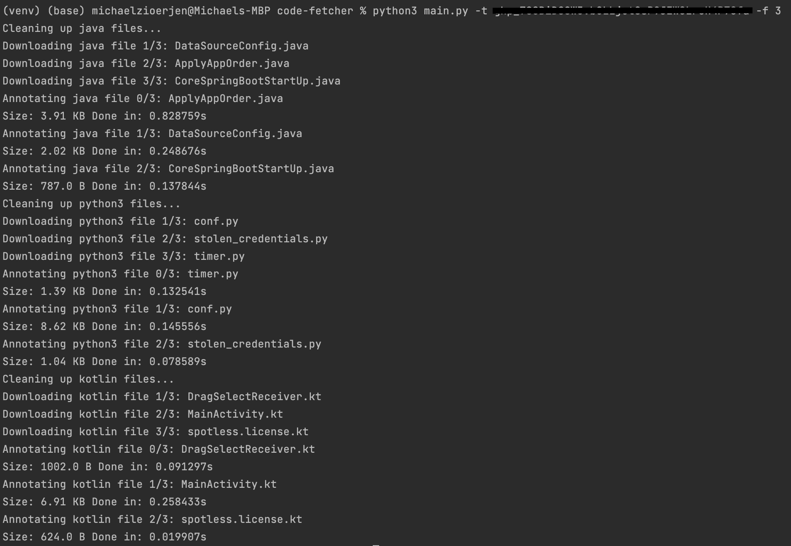

# Code Fetcher
This python script can be used to download and highlight files from the 300 most starred repositories on GitHub.
The script will download a specified amount of files for all three languages first and then send them to the API.
Furthermore, it will measure the time the API uses to highlight the file and store all the measurements in a CSV file
for further analysis.

The code-fetcher was used both for performance analysis and to download a large amount of files to train the underlying deep learning model.

## How to use
Execute the script in the terminal with the following arguments:
- `-t` your github access token (to download the files from GitHub)
- `-f` [optional] amount of files to download per language (defaults to 1000)
- `-u` [optional] url of annotation service (defaults to public url in docker-compose)
- `-o` [optional] file where benchmark output is stored (defaults to `benchmark.csv`)

```bash
$ python3 main.py -t <GITHUB_TOKEN> -f 120
```

The files downloaded will be stored in `java`, `python3` and `kotlin` folders. These folders will be cleared when the script is invoked.

## Example Output
