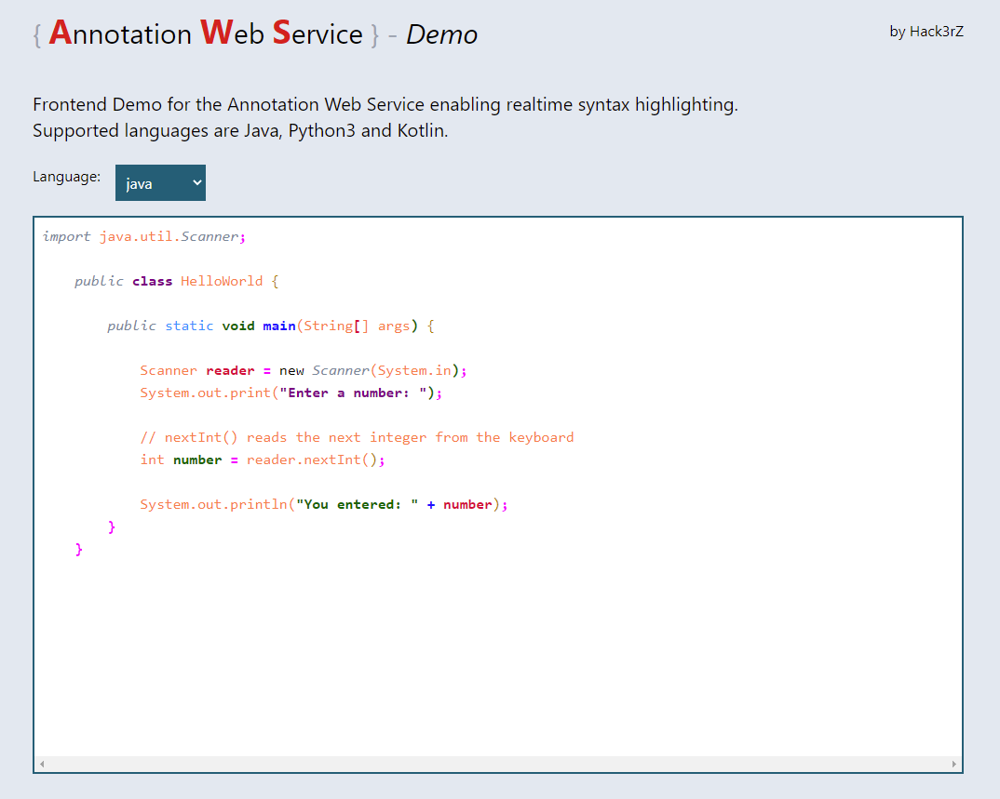

# Demo Application

This demo was created to show the syntax highlighting in action to demonstrate the progress to our clients.

## Setup

This demo is accessible after launching the project-wide docker-compose file at localhost:8081:

```bash
# inside project root /:
docker-compose up
```
You can also launch this app without docker for development:
```bash
# inside /demo-frontend:
npm install
npm run dev
```
<br>

