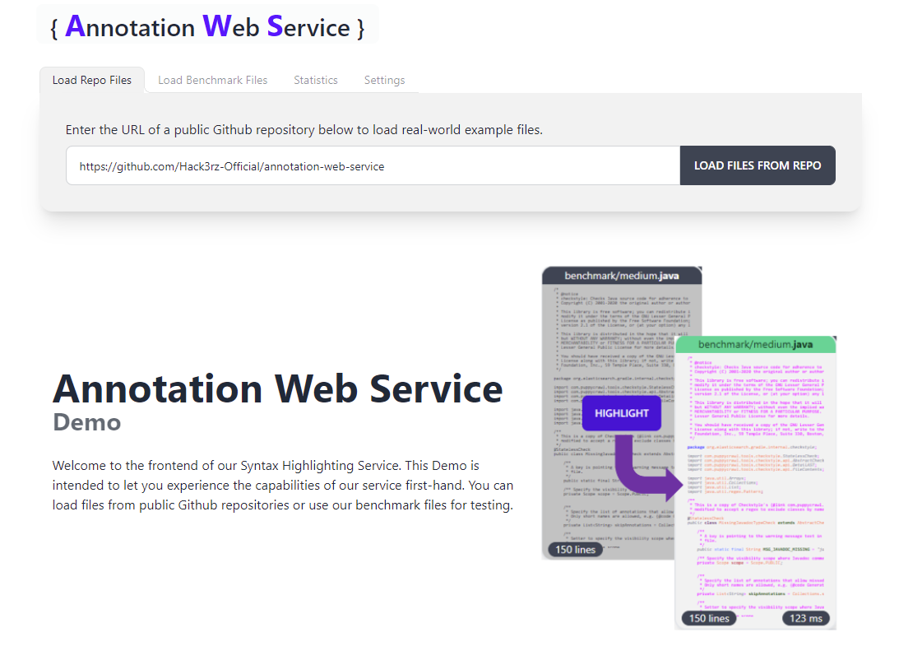

# Demo Frontend

This demo was created to show the capabilities of our Annotation Service in action. It covers the following features:
- Load source code files from existing Github repositories
- Load Benchmark files for reproducible performance testing
- Perform Highlighting requests for individual files or in bulk
- Edit source files to see how the API responds to semantically invalid code snippets
- Change language of files, including invalid languages
- Analyze response times with visualized Statistics
- Simulate up to 10 concurrent requests

A more detailed documentation can be found in the [demo part of our Wiki](https://github.com/Hack3rz-Official/annotation-web-service/wiki/Demo).

## Configuration
The service expects the following environment variables:
| **Variable Name**             | **Description**                                             | **Example Value**                                                                                 |
|-------------------------------|-------------------------------------------------------------|---------------------------------------------------------------------------------------------------|
| `DEMO_FRONTEND_PORT`     | The port on which the frontend application will be hosted    | `80`                                                                                            |
| `WEB_API_PORT`        | The port of the exposed web api service       | `8081` |

These variables can be placed in the `.env` file in this directory for local development. 

## Run Service Locally
Execute the following code from the `/demo-frontend` directory:

```bash
npm install
npm build
npm run dev
```

**Note:** Because this service depends on other microservices from the AnnotationWebService project, we recommended executing the docker-compose file in the project root to prevent dependency issues.
 
<br>

