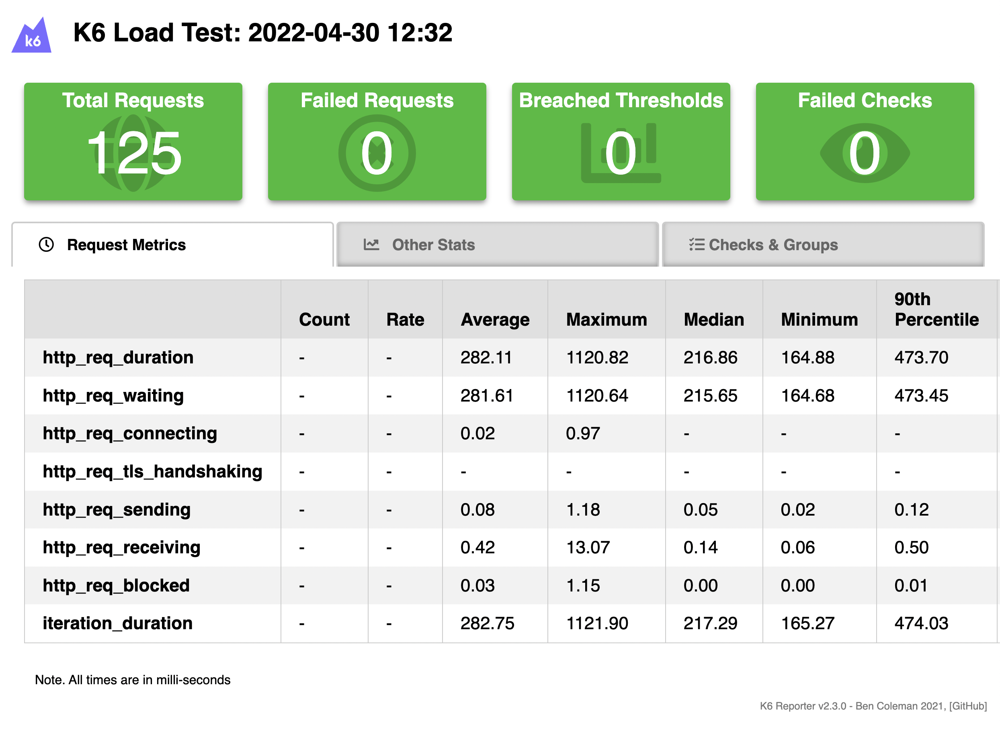

# Load Tester

This script can be used to load test the API. It uses the popular [K6](https://k6.io/) load testing library. The load-testing will be performed for a specified amount of time with a number of concurrent requests. Currently, the script uses a single 157 LoC java file to perform the load testing. 

This script was mainly used in the beginning of the project before the demo-frontend was extended with similar performance analysis functionality. In contrast to the demo-frontend, more than 6 concurrent requests can be sent using the k6 load testing library so it is still an important tool to measure the performance of the system.

## Installation
Please follow the [k6 installation instructions](https://k6.io/docs/getting-started/installation/) to install the library on your machine.

## How to Use
After installing the k6 library, run the following command in your terminal:
 ```bash
$ k6 run script.js
 ```
The script will produce a `summary.html` file in the root that will display an overview of the measurements attained during the test run.

## Example Output
The screenshot below shows an example output of the `summary.html`. Please note that the values provided in this output vary greatly depending on the hardware that the load-testing is performed on. Ideally, the load testing will be performed on a deployed production version of the service.

